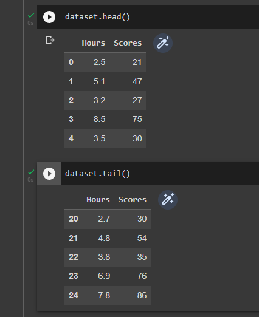
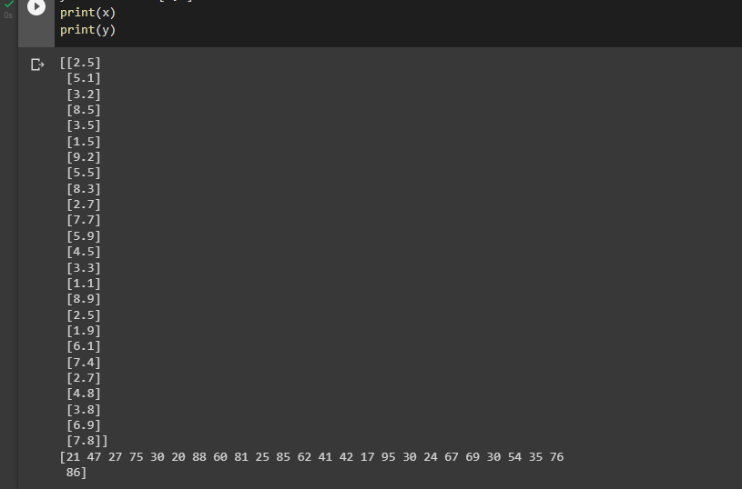
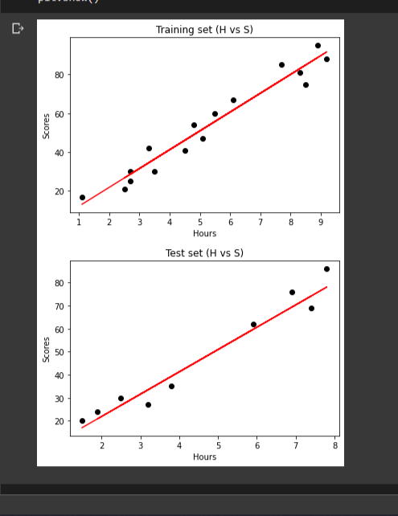
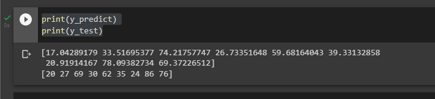
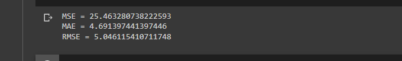

# Implementation-of-Simple-Linear-Regression-Model-for-Predicting-the-Marks-Scored

## AIM:
To write a program to predict the marks scored by a student using the simple linear regression model.

## Equipments Required:
1. Hardware – PCs
2. Anaconda – Python 3.7 Installation / Jupyter notebook

## Algorithm
1. Read the given dataset
2. Assign values for x and y and plot them
3. Split the dataset into train and test data
4. Import linear regression and train the data
5. find Y predict
6. Plot train and test data
7. Calculate mse,mae,rmse

## Program:
```
/*
Program to implement the simple linear regression model for predicting the marks scored.
Developed by: S.Thirisaa
RegisterNumber:  212220040171


#implement simple linear regression model for predicting the marks scored
import pandas as pd
import numpy as np
dataset=pd.read_csv('/content/student_scores.csv')
dataset.head()
dataset.tail()
x=dataset.iloc[:,:-1].values
y=dataset.iloc[:,1].values
print(x)
print(y)
from sklearn.model_selection import train_test_split
x_train,x_test,y_train,y_test=train_test_split(x,y,test_size=1/3,random_state=0)
from sklearn.linear_model import LinearRegression
reg=LinearRegression()
reg.fit(x_train,y_train)
y_predict=reg.predict(x_test)
import matplotlib.pyplot as plt
from sklearn.metrics import mean_absolute_error,mean_squared_error
plt.scatter(x_train,y_train,color='black')
plt.plot(x_train,reg.predict(x_train),color='red')
plt.title('Training set (H vs S)')
plt.xlabel("Hours")
plt.ylabel("Scores")
plt.show()
plt.scatter(x_test,y_test,color='black')
plt.plot(x_test,reg.predict(x_test),color='red')
plt.title('Test set (H vs S)')
plt.xlabel("Hours")
plt.ylabel("Scores")
plt.show()
print(y_predict)
print(y_test)
mse=mean_squared_error(y_test,y_predict)
print('MSE =',mse)
mae=mean_absolute_error(y_test,y_predict)
print('MAE =',mae)
rmse=np.sqrt(mse)
print('RMSE =',rmse)
*/
```

## Output:







## Result:
Thus the program to implement the simple linear regression model for predicting the marks scored is written and verified using python programming.
